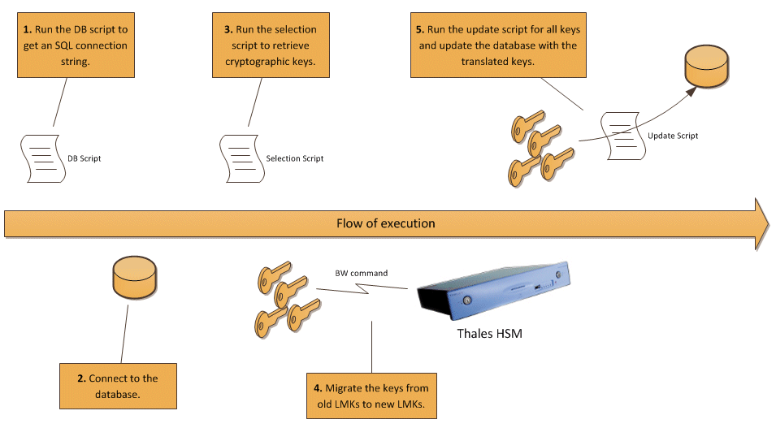

**Project Description**
LMKTool is a small project that helps users to migrate Thales cryptographic keys from the old LMK to the new LMK set.

When the LMK set of a Thales HSM is changed, uses are faced with the need to perform migration of existing cryptographic keys from the old LMK to the new LMK set. The LMKTool tries to perform that task but also allow end users to configure the way it retrieves, selects and updates cryptographic keys. The reason for this is that cryptographic keys are nowadays stored in databases but the exact details may vary depending on the system that uses them. What is the location of the database server? What credentials should be used to access it? What is the name of the table with cryptographic key values and what is its layout? What keys does the end user need to update using an LMK translation and which keys are updated in another fashion (for example a dynamic key exchange)?

To achieve a level of flexibility, LMKTool uses the [Jint script engine](http://jint.codeplex.com/) to perform parts of the necessary processing in a manner that can be radically changed by the end user. LMKTool works in five steps, as depicted below.

**Step 1**: LMKTool runs the +db script+, which returns an SQL connection string. This information will be used to connect to the database which holds the cryptographic keys.
**Step 2**: Using this information, LMKTool connects to the database.
**Step 3**: LMKTool runs the +selection script+ which selects specific keys from the database. This is a script that is customized on a per-case basis. End users are expected to know the location and layout of the database table where cryptographic keys reside in order to customize this script.
**Step 4**: LMKTool connects to a Thales HSM and translates all keys selected in the previous step. The translated values are kept internally by LMKTool.
**Step 5**: For each key, LMKTool runs the +update script+ which updates the cryptographic key value in the database. Like step 3, this script is customized on a per-case basis. If all keys are successfully updated, LMKTool commits the changes to the database, otherwise a rollback is initiated.

LMKTool comes with sample scripts that are used to migrate terminal and network KEKs that reside in a Postilion database.